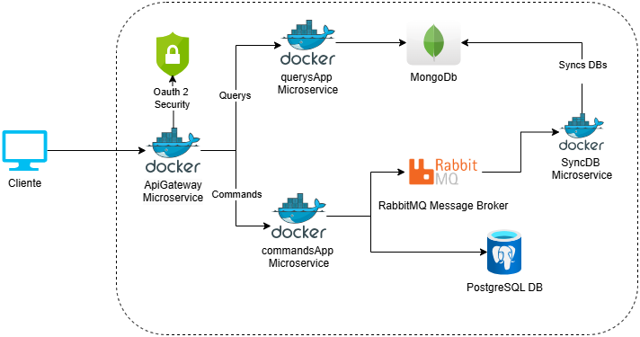

# Prueba tecnica para factured.

## Problema y contexto

**Caso practico:** Los usuarios necesitan gestionar tableros y tareas asociadas a ellos, además de generar reportes con alto volumen de datos para analizar el estado y distribución de las tareas.

Funcionalidades requeridas:
- CRUD para tableros y tareas.
- Mover tareas entre estados (pendiente, en progreso, completada).
- Generar reportes con conteo de tareas por estado y tablero, con estadísticas básicas como proporción de tareas completadas.

## Detalles técnicos de la solución.

**Diagrama de la arquitectura:**

#### Tecnologias utilizadas:
- **docker:** permite crear, ejecutar, monitorear y compartir aplicaciones en contenedores, ayuda a optimizar el ciclo de vida de desarrollo, ya que permite trabajar en entornos estandarizados, haciendo facil la portabilidad para el desarrollo e instalación en diferentes entornos.
- **django rest framework:** Es un framework de desarrollo web para el lenguaje python, que facilita la creación de API RESTful.
- **postgresql:** base de datos relacional de código abierto que se utiliza para almacenar y gestionar datos. Es conocida por su flexibilidad, fiabilidad y compatibilidad con estándares técnicos abiertos.
- **mongodb:** es un sistema de gestión de bases de datos (SGBD) no relacional y de código abierto. Se utiliza para almacenar y procesar datos en formato flexible, en lugar de tablas y filas.
- **rabbitMQ:** es un agente de mensajes distribuido que recopila datos de streaming de múltiples orígenes y los reenvía a diferentes destinos para su procesamiento. 

#### Patrones utilizados:
- **Patron CQRS:** es un patrón de arquitectura de software que separa las acciones de lectura y escritura de datos. Esto permite optimizar cada modelo de forma independiente.
- **Patron productor-consumidor:** es un patrón de diseño que se utiliza para separar los procesos de producción y consumo de datos. Su objetivo es mejorar el intercambio de datos entre ciclos que se ejecutan a diferentes velocidades. 
- **Singleton:** es un patrón de diseño creacional que nos permite asegurarnos de que una clase tenga una única instancia, a la vez que proporciona un punto de acceso global a dicha instancia.

#### Instrucciones para ejecutar la aplicación utilizando Docker.

[Guia de Instalacion (clic aqui). ](./docs/INSTALACION.md)

#### Justificación del uso de patrones de diseño, CQRS, y tecnologías seleccionadas.

##### Justificación Patrones
- **Patron CQRS:** Principalmente por la escabilidad y optimización, permitiendo mejorar la lectura o escritura a medida los usuarios crezcan.
- **Patron productor-consumidor:** El patron CQRS añade complejidad, además al tener las bases de datos de lectura y escritura separadas, estas pueden llegar a desincronizarse, haciendo uso de este patron se puede hacer uso de un broker de mensajeria que ayuda a mantener sincronizada ambas bases de datos.
- **Singleton:** Optimiza el rendimiento a las conexiones de bases de datos, broker de mensajes, permitiendo la creación de una sola instancia de la conexión, mejorando el uso de recursos.

##### Justificación Teconologias
- **django rest framework**: es un framework muy robusto y usado por la comunidad, facilita la conexión a diferentes sistemas como bases de datos, brokers, etc. gracias a las librerias con las que cuentan, además de brindan una estructura organizado al desarrollar Apis.
- **postgresql:** Es una base de datos SQL de software libre con una gran comunidad por detras, posee caracteristicas de alta disponibilidad, rendimiento, integridad y seguridad de datos, maneja transacciones ACID, escrituras concurrentes, por lo que se opto como la base de datos de escritura.
- **mongodb:** Es una base de datos NoSQL, permite flexibilidad en el modelo de datos a almacenar y facilidad para escabilidad horizontal, caracteristicas por la que se opto como la base de datos de lectura.
- **rabbitmq:** es un sistema de mensajería basado en el protocolo AMQP, que cuenta compatibilidad con diferentes lenguajes de programación, alta escabilidad, fiabilidad y durabilidad de los mensajes, optimo para transportar los mensajes sobre actualizaciones en la base de datos de escritura y su sincronización con la base de datos de lectura.

#### Detalle de la práctica OWASP implementada y cómo mejora la seguridad de la solución.

Se hizo uso de las siguientes practicas:
- **Autenticación y Autorización:** Se hizo uso del standar OAUTH2, y se protegio todas las apis de la solución para que solo se pueda hacer uso de ellas un usuario auntenticado y autorizado.
- **Exponer Solo lo Necesario:** los microservicios de Escritura, lectura y sincronización no han sido expuestos, estan dentro de una red privada, y se creo un ApiGateway que es el unico punto accesible para los usuarios, provee la seguridad y es el unico que puede conectarse a los diferentes servicios dentro de la red.