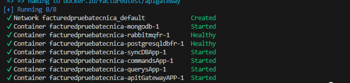
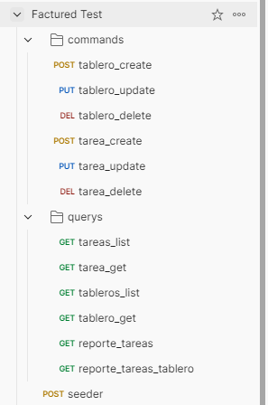
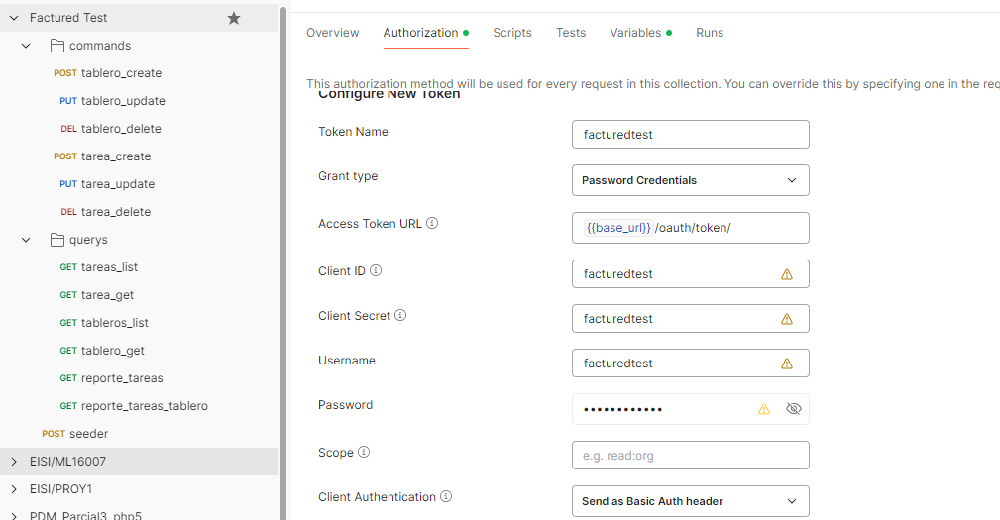
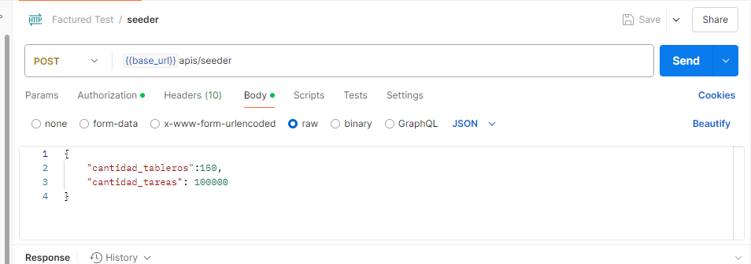
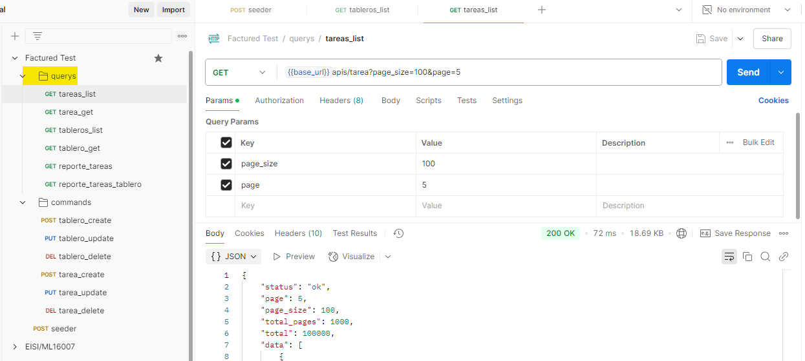

# Instalación y uso de la solucion

## Requerimientos
- Docker y docker compose instalados
- Postman
- Git

## Instalacion
1. descargar repositorio de github: https://github.com/alejandroml98/facturedPruebaTecnica
2. entrar en la carpeta principal y levantar contenedor de docker compose.
`docker compose -f "docker-compose.yml" up -d --build`

3. esperar a que todos los contenedores esten arriba(postgresdb, mongodb, rabbitmq, apigatwayApp, querysApp, commandsApp, syncDBApp)

4. importar colleccion de apis en postman, usando el archivo: [collecion postman.json
](Factured%20Test.postman_collection.json)

## Uso

1. Obtener token oauth para usar apis:
username = facturedtest
password = facturedtest
{{base_url}} = http://localhost:8000

2. consumird enpoint seeder para insertar 100k registros iniciales (puede tardar de 5-10 minutos en insertar los datos):
cantidad_tableros = cantidad tableros a insertar
cantidad_tareas = cantidad a tareas a insertar

3. command Apis: apis para modificar tableros y tareas en la base datos de escritura.

4. querys Apis: para leer tableros, tareas y reportes desde la base de datos de lectura.

